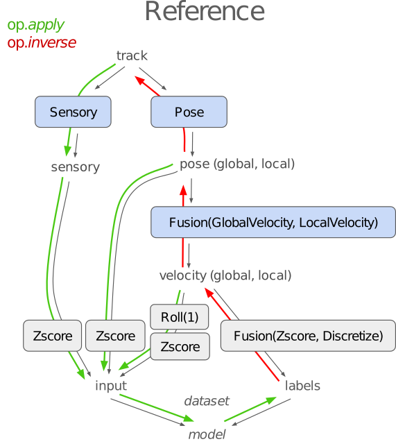
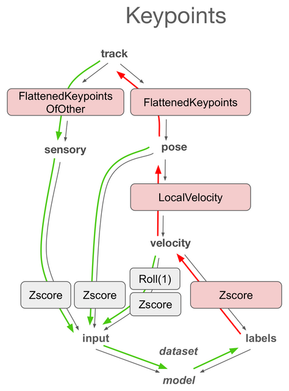
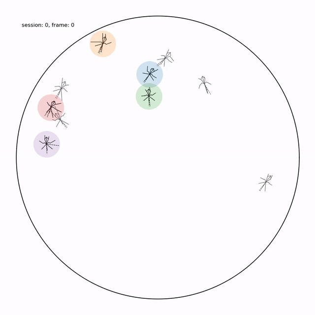
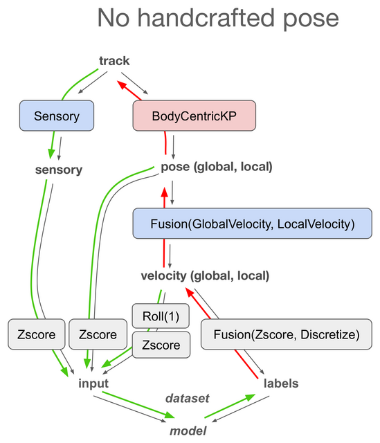
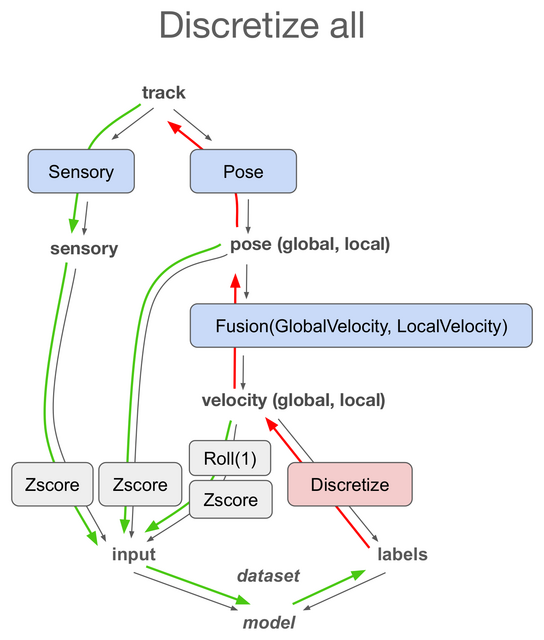
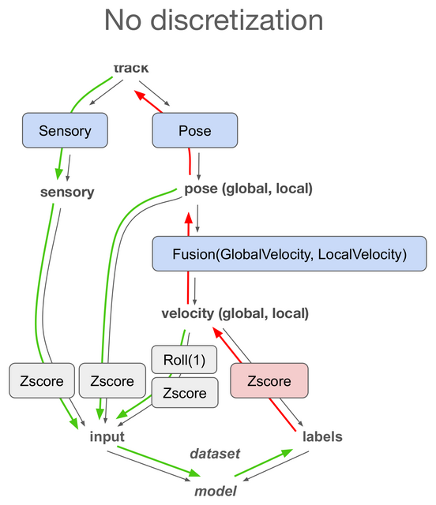
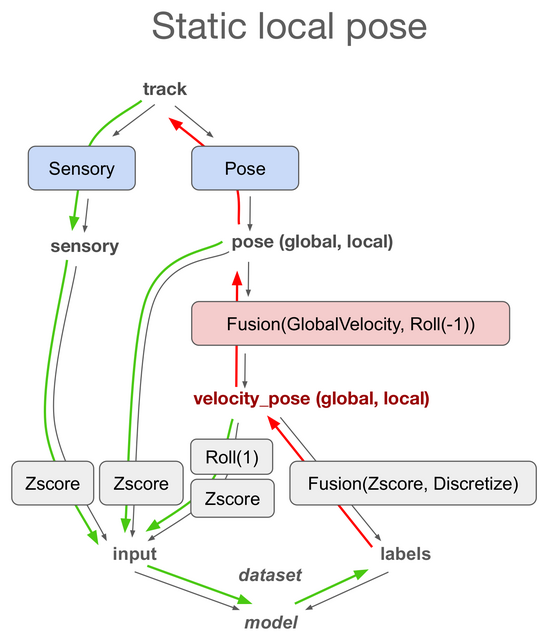
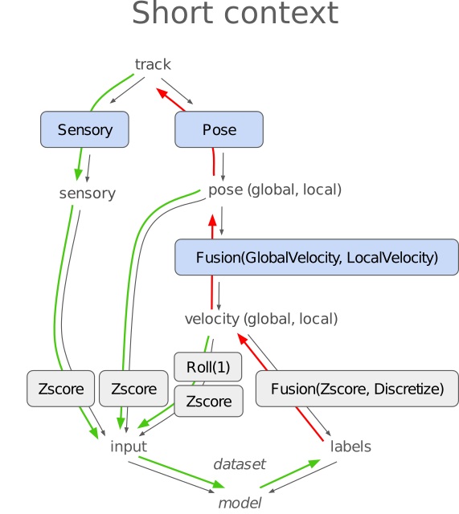

# Animal Pose Forecasting Library

| **Real trajectories** | **Agent-centric simulation** |
|:---:|:---:|
|  |  |

> 🚧👷‍♀️ **Under construction** — this library and its documentation are a work in progress. 🏗️🚧

The Animal Pose Forecasting library (APF) contains code for training, simulating from, and evaluating **agent-centric** autoregressive models of **animal behavior** from tracked **pose**. Unlike standard world-frame approaches, agent-centric models input egocentric sensory observations and output egocentric movements, mirroring the biological constraint that animals observe and act on the world from their own reference frame. Social behavior emerges from agents independently sensing and responding to one another. 

This Python and PyTorch-based library is built around the observation that, to train and generate from agent-centric models, the **same data** needs to be available in **many representations**: world-frame, egocentric, sensory, ML-friendly. Translating between these representations requires **composing sequences of operations** or their inverses. Our library makes these operations explicit, manipulable objects that are composable, invertible, and serializable alongside the model. The sequence of operations applied to a chunk of data is itself stored, so the library knows how a given representation was constructed and can invert or serialize it on demand.

## Model variants

For each variant, the flow diagram (left) shows how data is transformed, and the GIF (right) shows a simulation from that model. Colored circles highlight simulated male flies; non-highlighted flies are real female flies. 

| Operations | Simulation |
|:---:|:---:|
|  |  |
|  |  |
|  |  |
|  |  |
|  |  |
|  |  |
|  |  |

## Credits

Library developed by [Eyrun Eyjolfsdottir](https://github.com/eyrun) and [Kristin Branson](https://github.com/kristinbranson)